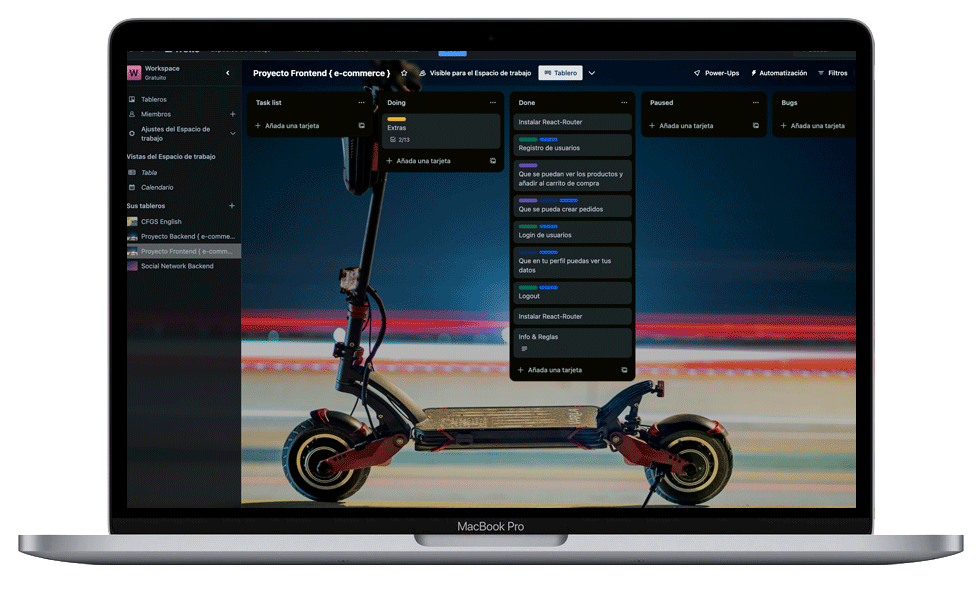

# 🛒 E-commerce Frontend Project

Welcome to my frontend project for an E-commerce application! Here, our focus will be on developing a user interface using React to meet the project requirements. 🚀

## 📝 Description

My frontend project aims to provide an intuitive user experience for an E-commerce platform. We'll implement key functionalities such as user registration, login, product visualization, cart management, order creation, and the ability to view user profiles.

### 🖥️ Core Components

The frontend will consist of the following core components:

- **Register:** Interface for users to register on the platform.
- **Login:** Login screen for registered users.
- **Home:** Main page of the application.
- **Products:** View to display available products.
- **Product:** Specific details of a product.
- **Shopping Cart:** Functionality to manage products added to the cart.
- **Profile:** Display of user data and their orders.
- **Header:** Main navigation of the application.
- **Footer:** Final section of the application.

### 🌐 React Router and Context

I'll use React Router to manage navigation between different views of the application. Additionally, I'll employ Context to handle global data efficiently.

### 🎨 Design and Styling

Design will play a crucial role in this project. I'll emphasize the importance of an attractive and user-friendly design. Moreover, I'll utilize SASS for style management and creating more dynamic interfaces.

### 📐 Constraints

To maintain clean and readable code, I'll adhere to the following constraints:

- Components won't exceed 400 lines of code.
- Functions won't surpass 75 lines of code.

## Getting Started

### Prerequisites

Ensure you have Node.js installed in your development environment.

### Installation

🔧 Below is an example of how you can instruct your audience on installing and setting up your app.

1. Clone the repo
   ```sh
   git clone https://github.com/cescalberola/ScooterRent_frontend_project.git
   ```
2. Install NPM packages
   ```sh
   npm install npm create vite@latest
   ```
3. Ready to start!
   ```sh
   npm start
   ```

## Contributing

🙌 Contributions are what make the open source community such an amazing place to learn, inspire, and create. Any contributions you make are **greatly appreciated**.

🌟 If you have a suggestion that would make this better, please fork the repo and create a pull request. You can also simply open an issue with the tag "enhancement".
Don't forget to give the project a star! Thanks again!

1. Fork the Project
2. Create your Feature Branch (`git checkout -b feature/YourName`)
3. Commit your Changes (`git commit -m 'Add some YourName'`)
4. Push to the Branch (`git push origin feature/YourName`)
5. Open a Pull Request

## Preview Workflow

<p align="center">
  
  
</p>

<p align="center">
  <!--REACT-->
  
  <!--REACT VITE-->
  
  <!--JAVASCRIPT-->
  
  <!--SASS-->
  
  <!--ANTDESIGN-->
  
  <!--NPM-->
  

</p>
